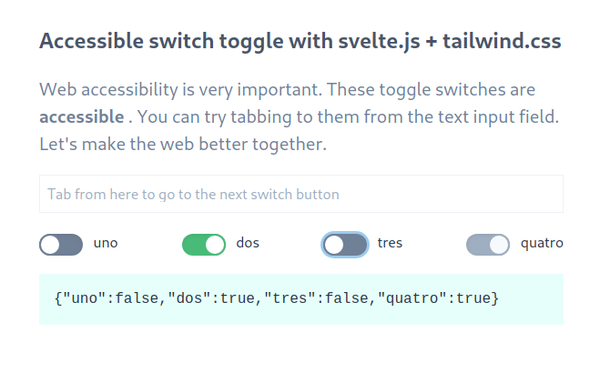

# svelte-toggle-switch-button

Example of how you can use Tailwind.css to create an accessible switch button
in Svelte for my article [Accessible switch toggle button with svelte.js and tailwind.css](https://codechips.me/accessible-switch-toggle-button-with-svelte-js-and-tailwind-css/).



## To run the example

``` bash
$ yarn start
```

## There is more!

For more interesting stuff like this follow me on [Twitter](https://twitter.com/codechips) or check out my blog https://codechips.me
